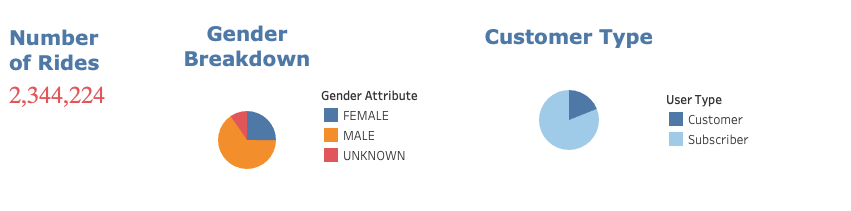
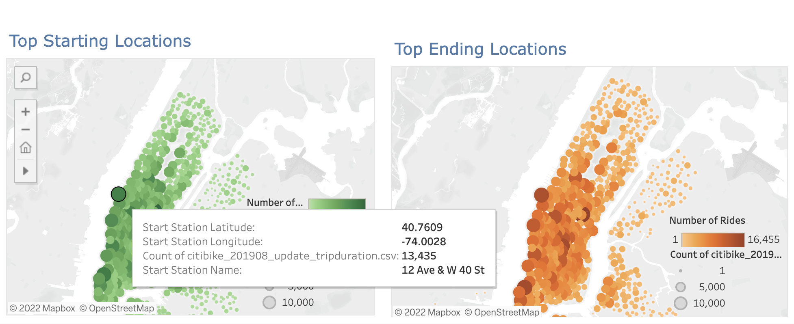
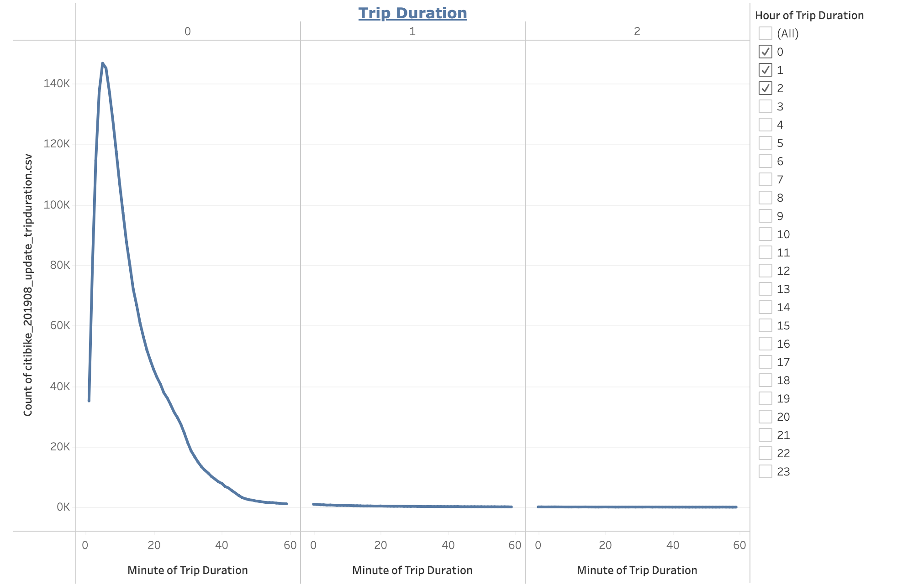
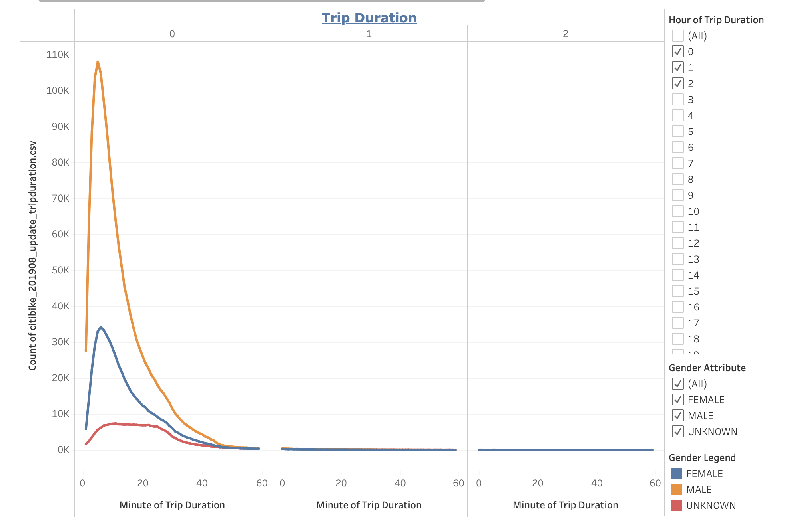
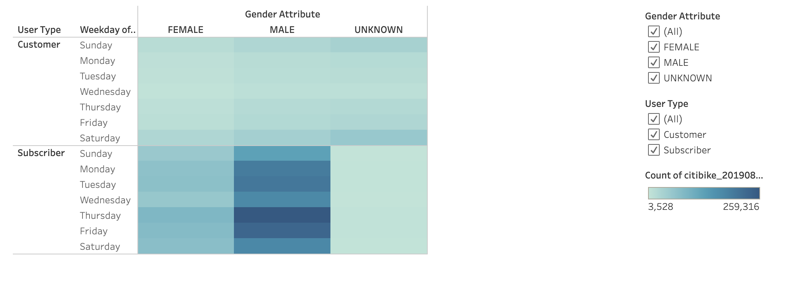
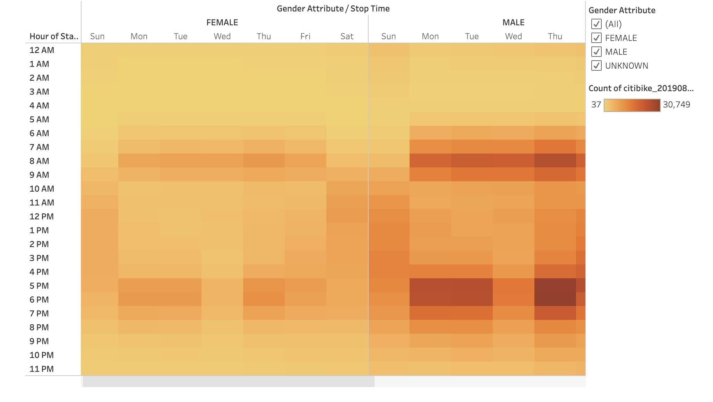
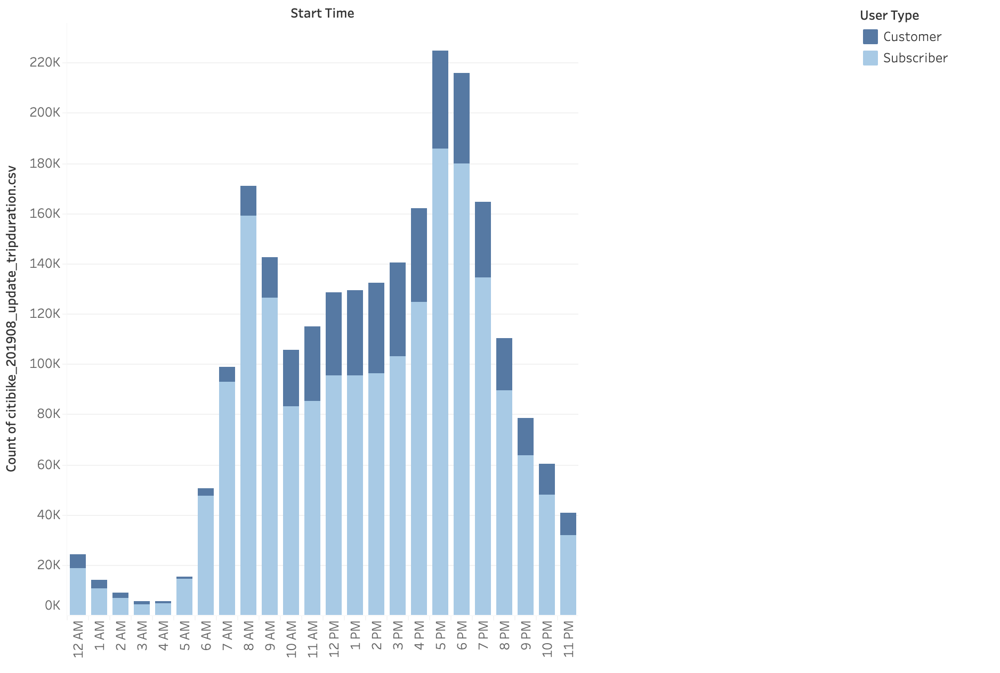
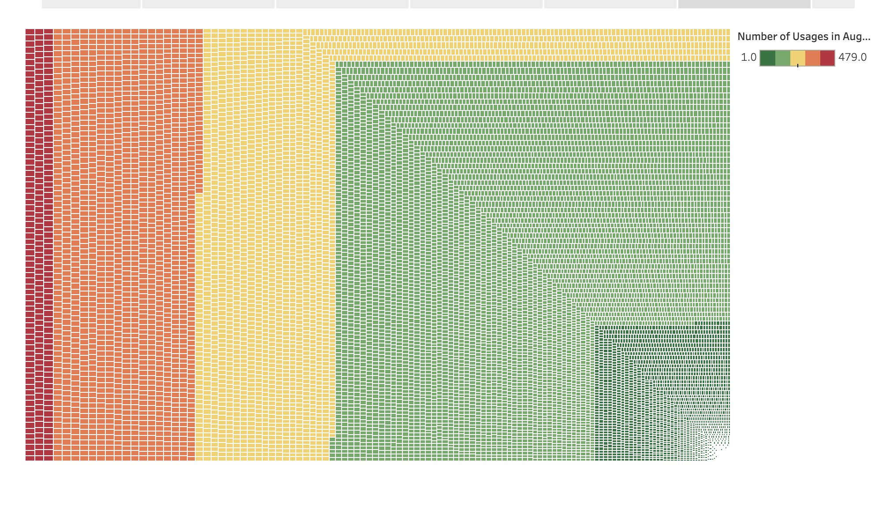
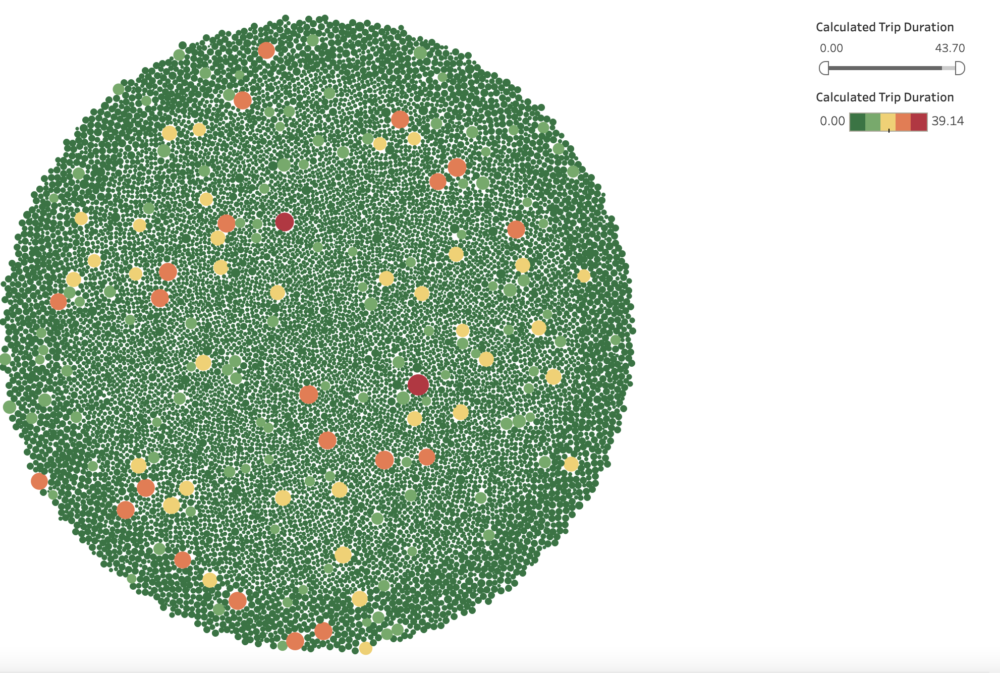
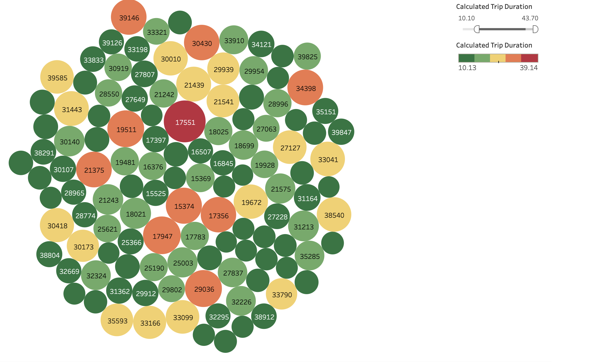

# NYC Citibike Bike Sharing Analysis 

## Overview
The goal of this project is to analysis bikshare data from NYC Citibike data set to see if a similar bikesharing program in Des Moines, Iowa would be successful. The analysis is designed to answer the following topics using data visulization. 

1. Customer Demopgraphics Usage Breakdown 
2. Trip Duration and Peak Hours 
3. Bike Ulitilization Rate At Given Hour 

The analysis is based off of the August 2019 data set from [citibike's website](https://ride.citibikenyc.com/system-data). It used Jyputer notebooks to clean up datatypes and Tableau for the visulization. You can click here for the [Tableau Visulization](https://public.tableau.com/app/profile/jjcode/viz/NYCCitiBikeAnalysis_16581155336310/CitiBikeStory?publish=yes)

## Results

### Customer Demographics 
Based on the information below we learn that August 2019 was a very popular month for bike riding in NYC. Most of the bike share riders are male and they are subscribers which indicates they are locals.

### Top Locations 
The top locations seems to be the metropolitan downtown areas and not the residental areas. 

### Trip Usage By Hour 
It appears average trip durations is only about an hour and males uses the services more  

### Trip Usage By Day of Week 
It appears during communte hours between 7am to 10am and 4pm to 8pm on weekdays have the highest number of trips. 

### Peak Hours By User Type 
The graph below reinforce the graphs directly above. It appears locals during communte hours uses the bike sharing services the most.  

### Bike Ultlization 
It appears most bikes are fully being used and there is not a lot of inventory that is not being used (aka bikes being used) 

## Summary 
In summary, it appears that the CitiBike service in NYC is being used the most by locals in the metropolitan areas to naviagate probably to and from work. The charts all show the highest peak usage are during communte hours on the weekdays by males. This makes sense since downtown Manhatthan is hard to navigate thru due to the population density and limited space. 

If a similar service was to start in Des Moines, Iowa we should first explore population desnity during weekdays during working hours and see if a need is present for such a service. We should also explore gender ratio since it appears that in NYC males tend to use this service more. In addition we should look at parking to population ratio during working hours in the metropolitan downtown areas to explore the need of this service further.

